# Solution Engineering North American Technology Division Interviews

***Note:*** This document is best viewed by clicking on this [github.io link](https://sblack4.github.io/learning-library/articles/solution-engineering-natd/)

## The Role 
Solutions Engineering is more BREADTH than depth. You take the products that is already been built - extend it with your coding skills and integrate it with other products thereby building a “SOLUTION”. **This is primarily a technical job** with client interactions (60-70% technical, 40-30% communication/business).

For a successful solution engineer - you need the following traits
* Solutions Engineering is more BREADTH than depth. You take the products that is already been built - extend it with your coding skills and integrate it with other products thereby building a “SOLUTION”. This is primarily a technical job with client interactions (60-70% technical, 40-30% communication/business).
* Good communication skills - you don’t build solutions for yourself -you build it for customers and REAL world!
* Desire to push yourself to understand a little of lot of things (you may touch upon Machine Learning, Analytics and at the same time core database or file parsing).  This is probably the most critical -do you have the drive and motivation to learn a lot!!
* Working under tight deadlines - our projects can be 2-6-week bursts.

## Interview Schedule 

The face to face interview process consists of a technical interview outlined below:

## Technical Presentation and Demo - up to 45 minutes

| Interview Section | Minutes | Description |
| --- | --- | --- | 
| Overview | 3 - 5 | Brief overview of yourself, covering your capabilities and technical experience |
| Journey to Cloud Presentation | 15 | Brief overview of Oracle's cloud platform to a potential customer that is interested in making the journey to the cloud |
| Touch the Cloud - Oracle Cloud Research and Demo | 15 | Brief demo on Oracle Cloud Product(s) of interest and relevence (Trial Account) |  
| Technical Q & A Interview | 10 | Technical Question and Answer Interview |

## Overview 

During this presentation, we ask that you provide a brief overview of yourself, including your technical experience and skills. It's not necessary to go into detail, as we will ask more questions during the **Technical Question and Answer Interview** section of the interview. 

## Journey to Cloud: Presentation

The scenario for the presentation is one where you need to present a technical/business overview of Oracle’s cloud platform to a potential customer that is interested in making the journey to the cloud. The customer audience consists of technical and business level attendees. This customer is interested in moving to the cloud but not sure whether it makes sense and whether Oracle is the right vendor. They are strictly on-prem today.  It is important to address both the business value and the technical value of the proposed solution.

This **presentation** should be no longer than <u>**15 minutes**</u> and can be based on the content found in the links provided below. This will leave enough time for Q&A.  A [Powerpoint deck is available at this link](FY18_Candidate_Cloud_Presentation.pptx). You do not have to use this specific presentation so feel free to customize it.  We suggest that you use your own words in presenting the slides. 

Key focus areas:
- Expect the audience to ask for clarification on any content you show. 
- Make sure you know the differences between DaaS, SaaS, PaaS and IaaS.
- Expect technical questions throughout the presentation and specifically slide 9.

Below are some links to study Oracle’s cloud platform, yet feel free to use other resources as well:

- [http://Oracle.com/cloud](http://Oracle.com/cloud)
- [https://www.oracle.com/cloud/cloud-summary.html](https://www.oracle.com/cloud/cloud-summary.html)
- [https://www.oracle.com/applications/customer-experience/data-cloud/solutions/data-as-a-service/index.html](https://www.oracle.com/applications/customer-experience/data-cloud/solutions/data-as-a-service/index.html)
- [https://www.oracle.com/cloud/saas.html](https://www.oracle.com/cloud/saas.html)
- [https://www.oracle.com/cloud/paas.html](https://www.oracle.com/cloud/paas.html)
- [https://www.oracle.com/cloud/iaas.html](https://www.oracle.com/cloud/iaas.html)

## Touch the Cloud: Oracle Cloud Research and Demo

**Touch the Cloud Presentation Overview**:

During this presentation, we ask that you provide a brief summary of the Oracle Cloud Products you have investigated, and that you feel are of interest and relevance. You can find the information you need from Oracle's main [Cloud Home Page](https://cloud.oracle.com/) website. From this website you can investigate Oracle's three categories of Cloud Offerings: [Platform as a Service](https://cloud.oracle.com/en_US/paas), [Infrastructure as a Service](https://cloud.oracle.com/en_US/iaas) and [Software as a Service](https://cloud.oracle.com/en_US/saas). Note: The job for which you are applying will focus primarily on **Platform as a Service** and **Infrastructure as a Service**.  

In this section of the interview, you will select **a single option** from the 2 options below. **Remember: You only have 15 Minutes!**:

### **Option 1: Obtain an Oracle Trial Account**
Using an Oracle Trial account you can research more in-depth any of the Oracle Infrastructure or Platform Cloud Services, and present or demonstrate in up to 15 minutes what you have learned from hands-on experience and interest in these products.  Instructions for how to secure an Oracle Trial Account are provided below. If you have any difficulties getting a trial account feel free to use option 2. 

**Instructions to register for Oracle Trial Account (Option1)**

Using an [Oracle Trial](https://github.com/sblack4/learning-library/blob/master/articles/solution-engineering-natd/README.md#oracle-trial-account) account you can research more in-depth any of the Oracle **Infrastructure** or **Platform** Cloud Services, and <u>**present or demonstrate in up to 15 minutes**</u> what you learned from your hands-on experience and interest in these products. ***The Trial account is a $300 credit for a 30 day use.*** Many of Oracle's **Platform** Services (e.g: Application Container Cloud Service, Container Cloud Service, Developer Cloud Service, Oracle Database / MSQL Cloud Services and Java Cloud Service provide simple demonstrations. Examples are also available using Oracle's **Infrastructure** Cloud Services.

- ***Note***: ensure you ***Do NOT*** select "***Yes, convert my account to Pay as you go at the end of the free promotion***" located in the Billing Section, as Checking this option would convert your account to Pay as you go after the $300.00 credit or 30 days have been fulfilled, and you would be responsible for the charges after the trial. 
- **Note**: You would need a valid credit card to register for an account. If you don't have a credit card - please let a recruiter know ASAP - so they can work with you to help you out. 

- **Note**: Depending on the cloud services that you use, the consumption of your cloud credits can vary greatly, so ensure that you understand the pricing structure for each cloud service you intend to use. Also, based on the cost of an individual cloud services, you may want to shut that service down when not in use to conserve credits. Every cloud service will contain information about that service's pricing. As examples, here are links to a few cloud service pricing pages: 

    - [Database Cloud Service Pricing](https://cloud.oracle.com/en_US/database/pricing)
    - [MySQL Cloud Service Pricing](https://cloud.oracle.com/en_US/mysql/pricing)
    - [Application Cloud Service Pricing](https://cloud.oracle.com/application-container-cloud/pricing)
    - [Developer Cloud Service Pricing](https://cloud.oracle.com/en_US/developer-service/pricing)
    - [Container Cloud Service Pricing](https://cloud.oracle.com/en_US/container/pricing)

If you are not able to secure an Oracle Trial account please notify your recruiter ASAP. 

### **Option 2: Recent Project Presentation**
During this presentation, we would like you to provide an overview (or demonstration) of a development project on which you have recently worked. Provide examples of the technology, programming languages, and methodologies you used during this project. Feel free to use the whiteboard or laptop available in the interview room. If you use powerpoint, please keep your presentation to approximately 5 slides. ***Please Note: If you are going to use Oracle Cloud Trial Account and demonstrate Option 1 you DO NOT need to present your project.*** ***Also Note: we do expect to see code! :)***

### **Expectation** 

We expect that you have made a sincere effort in using the cloud service(s) that you select to do the following:

- Show your capability to learn Oracle’s cloud services

- Provide us with critical feedback if there were roadblocks 

- Build out a simple solution/product/project leveraging one or more Oracle Cloud services.  While we would like to see a finished product (even if it is simple), we are more interested in your approach to building things out.  

- Suggest you look at data sets from Kaggle or other areas in public domain, leveraging REST APIs from popular non-Oracle cloud services (Maps, Twitter, Instagram, Dropbox, Box etc).  Ideally, we are looking for a full-stack development that shows us the capability to not only create front-end Apps, but also an understanding of how to connect to the backend systems.  

- Use any programming language of your choice while coding. Python, Java, Node.js, React.js, i.e. anything that you are comfortable with -  doesn’t matter to us.  

## Technical Question and Answer Interview

During this section of the interview we will ask technical questions based on your experience, and our requirements of the Solution Engineering position. We hope to gain a better understanding of your development expertise, your understanding of development methodologies, and your experience with various programming languages and open source tools and frameworks. 

## Visual Aids

- The interview room will be furnished with a whiteboard and laptop that you can use to present your **Journey to Cloud** and **Touch the Cloud** Presentations.
- Oracle Supplied Laptop: We will have a laptop and prejector available for your use. The laptop will have connectivity to the internet, and you can bring a USB drive if you desire to load a presentation to the laptop.

# Oracle Trial Account

Acquiring an Oracle Account is not required for the interview, however, doing so will allow you to see first hand some of Oracle's cloud products before your interview. 

To get an Oracle Trial account, please go the [Oracle Try It](https://cloud.oracle.com/tryit). From this website you can find answers to your questions concerning the Free Trial account, along with step by step instructions on how to register your account. After your account is provisioned, some of the services you may desire to use require that your Account's Storage Replication policy is set prior to using those services. Those instructions are provided later in this guide.

## Step by step instructions on Provisioning your Account

I've tried to keep this information as up-to-date as possible 
but the crew who creates our [workshops](https://github.com/oracle/learning-library/tree/master/workshops) 
makes sure the documentation in their [microservices-devops](https://oracle.github.io/learning-library/workshops/microservices-devops/) workshop. 

### Prerequisites (have these ready)
* Cell Phone 
* Credit Card
* Email Address

### 1. View Details and Sign Up

- From the [**TryIt**](https://cloud.oracle.com/en_US/tryit) page, click on the [**Create a Free Account**](https://myservices.us.oraclecloud.com/mycloud/signup?language=en) button

    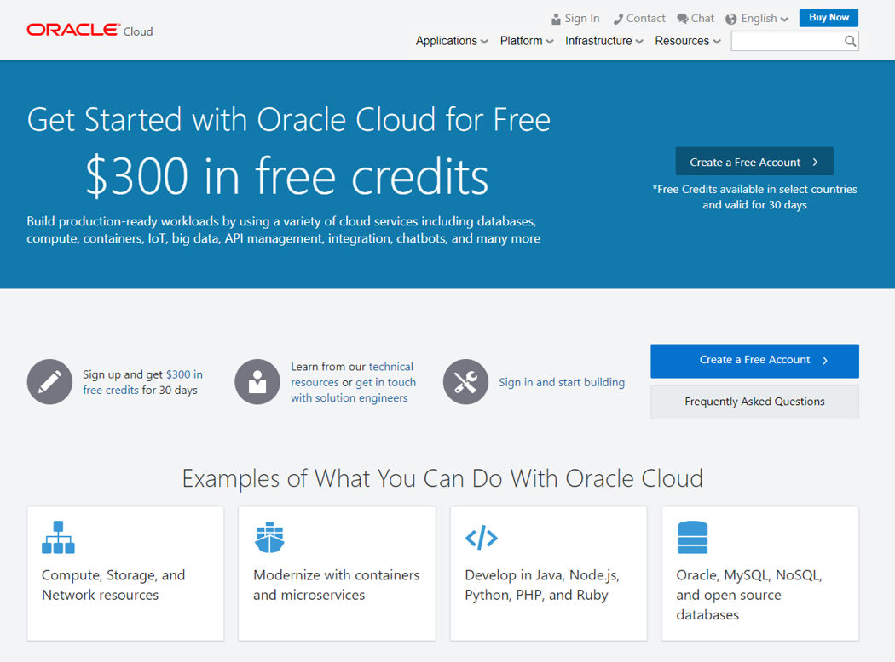

### 2. Create your Account

- Enter the required information on the **Sign Up for Free Oracle Cloud Promotion** page, and fill the **Account Details** with your information. 

    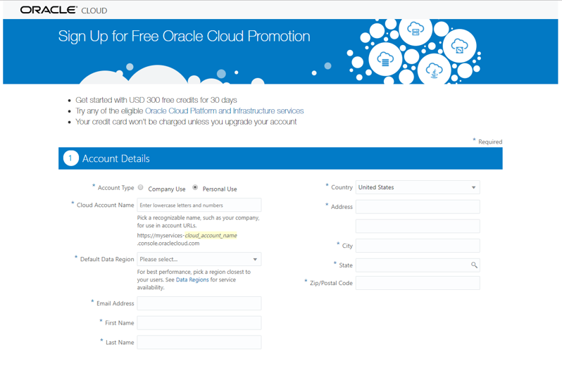

### 3. Verify your Mobile Phone

- Enter your **Mobile Phone Number** and click on **Request Code**

    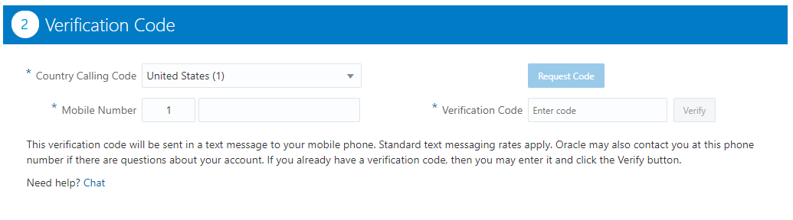

- You should get a text message from 228-84

    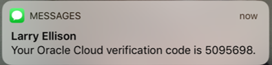

- Enter the **Verification Code** you receive via a phone text message.

    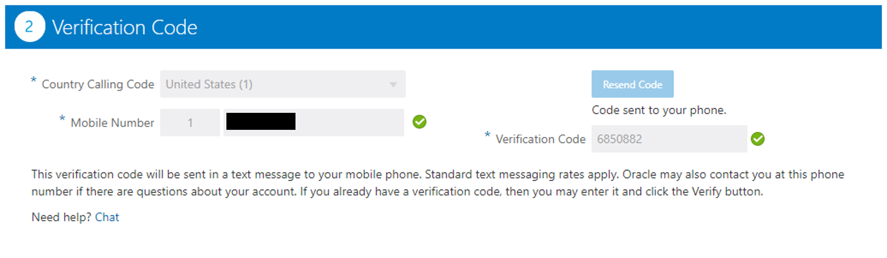

### 4. Add Credit Card

- Read the information about the use of your credit card, and Click on the **Add Payment Method** button.

    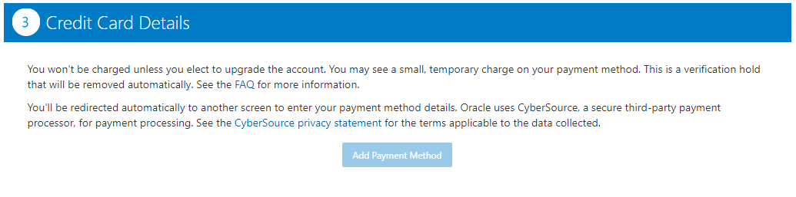

- You may be asked to use a Verified Address. If the Verified Address is correct go ahead and use it, if not provide one.

- Enter your credit card information, and click on **Finish**.

    

- **Accept** the terms and conditions, then click on the **Complete** Button. 

    

- Hold on for your account information! They should come to your email within 15 minutes.

    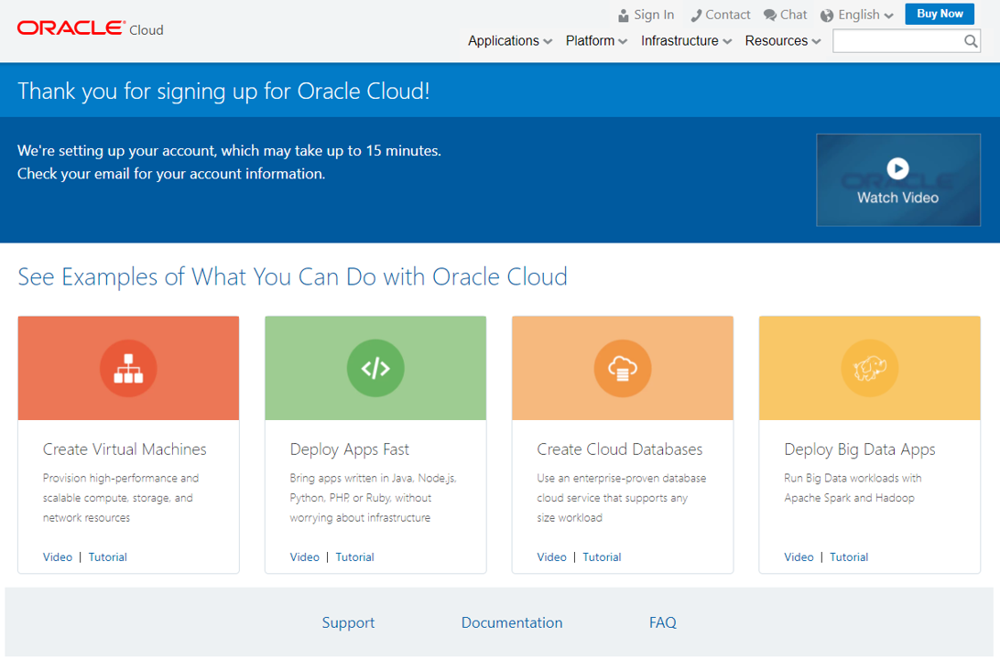

### 5. Account Confirmation Email

- You will receive a confirmation email from oraclecloudadmin_ww@oracle.com with access details **save this email**. Click the **Get Started with Oracle Cloud** button. This will direct you to a login page. This will be followed by a similar email with more information about specific services. 

    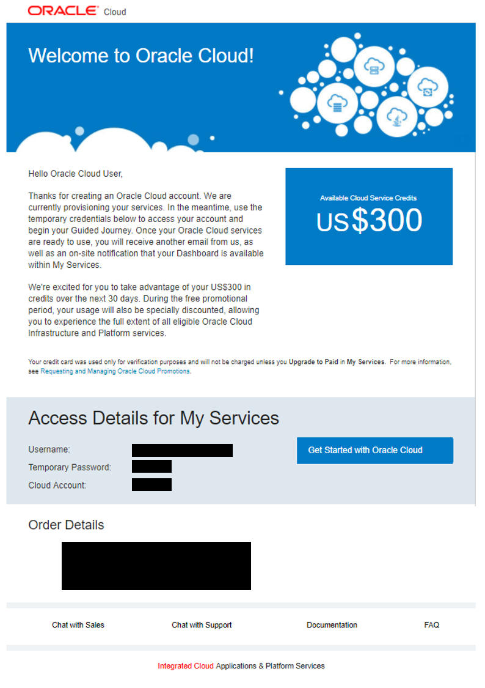

- Sign in with the **Username** and **Temporary Password** given in the confirmation email. 

    

- Create a **New Password** (your "Old Password" is the temporary one from the confirmation email). Once all the Password Criteria are fulfilled click **Submit** and make sure to record this new password. 

    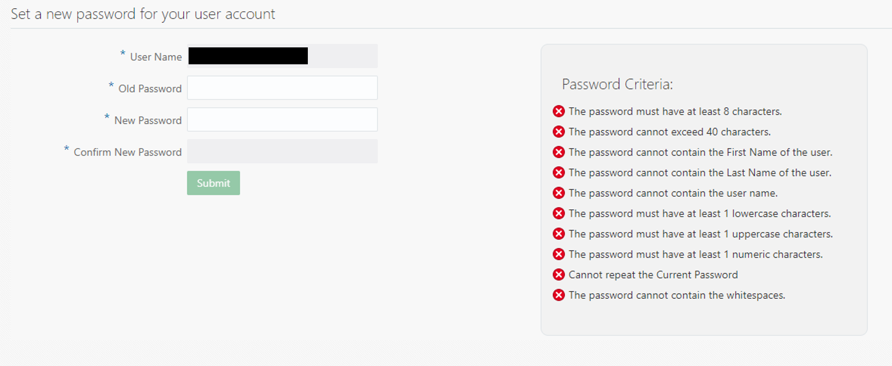

- Congradulations! You've logged into [Oracle Cloud](https://cloud.oracle.com)

    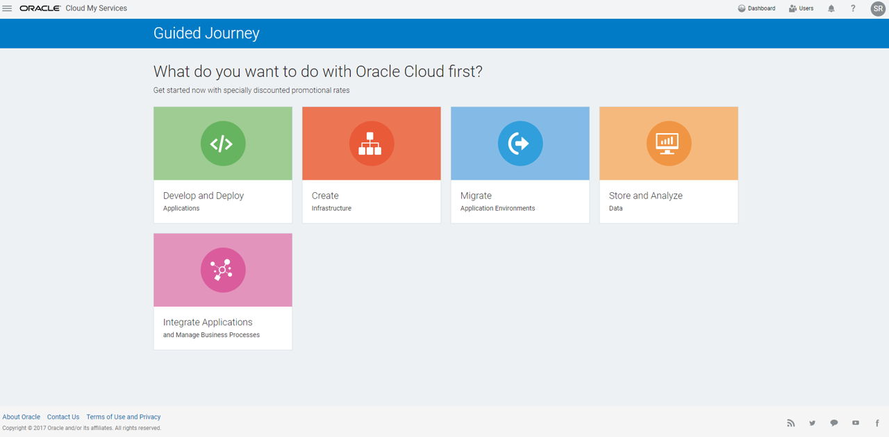

- Once you've updated your password you'll recieve a confirmation email from no-reply@oracle.com. 

    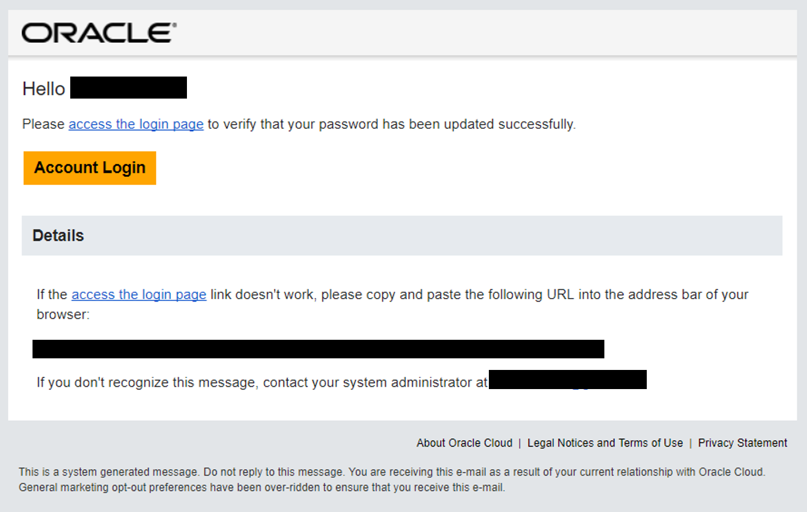

### 6. Welcome to Oracle Cloud!

- Get going creating a dazzling **Touch the Cloud** presentation! If you need help Oracle has a presence on [YouTube](https://www.youtube.com/user/Oracle), [Medium](https://medium.com/oracledevs), as well as [official documentation](https://docs.oracle.com/en/), and [official blogs](https://blogs.oracle.com/)

## Configure Your Storage Replication Policy

Once your Trial Account is fully approved and provisioned, you will need to set your Storage Replication Policy. We recommend that you do this as soon as your account is fully provisioned, otherwise some of the PaaS services that may be of interest will not work correctly. The Replication Policy is not automatically set to allow for flexibility on how how it is configured.

### Login to your Oracle Cloud Account
- To **log in** to **My Services Dashboard** or after logging out, go to [cloud.oracle.com](https://cloud.oracle.com) and click **Sign In**

    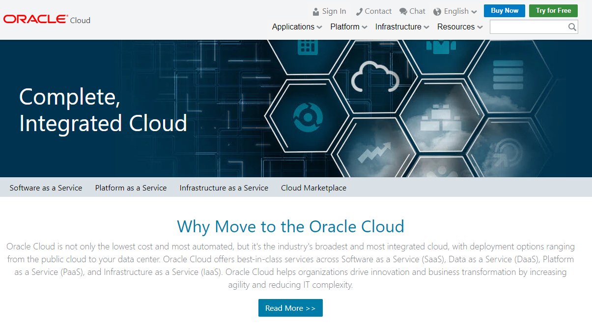

- This will direct you to [cloud.oracle.com/en_US/sign-in](https://cloud.oracle.com/en_US/sign-in). Sign in with the **Cloud Account** from your initial confirmation email. 

    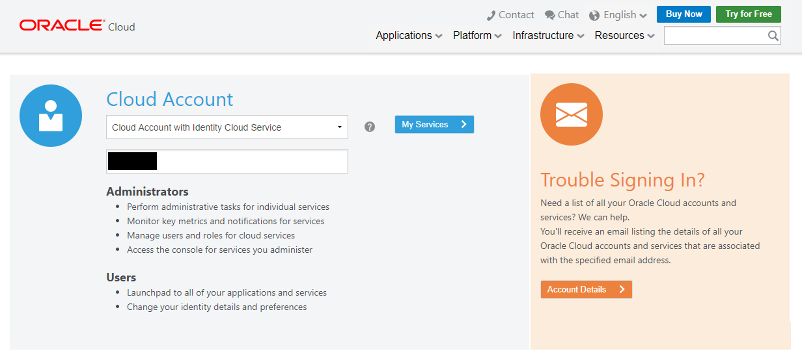 
    
- Once logged in, you will be presented with a Dashboard displaying the various cloud services available to your account.

    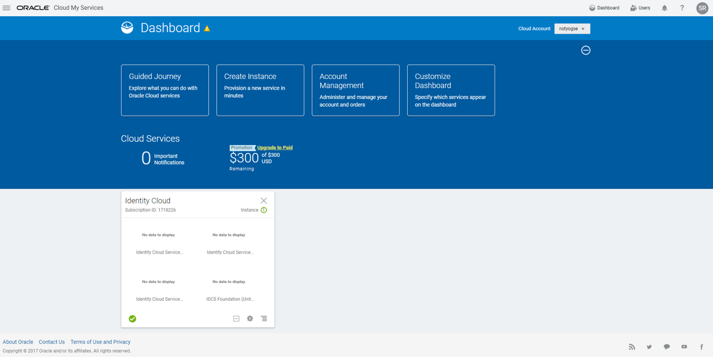

- If your **Storage** cloud service are not visible, **click** on the **Customize Dashboard**.

    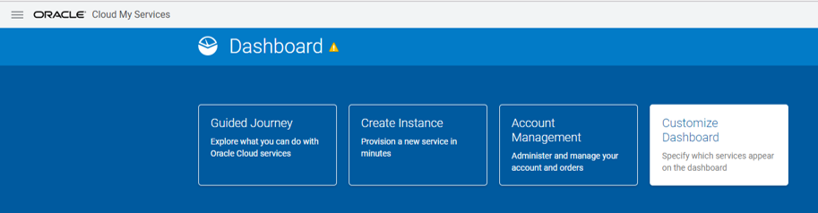
-  This will allow you to add services to the dashboard by clicking **Show.** For example, you can show the **Application Container, Developer and Storage** cloud services. If you do not want to see a specific service, click **Hide**. In this case click **Show** for **Storage Classic**

    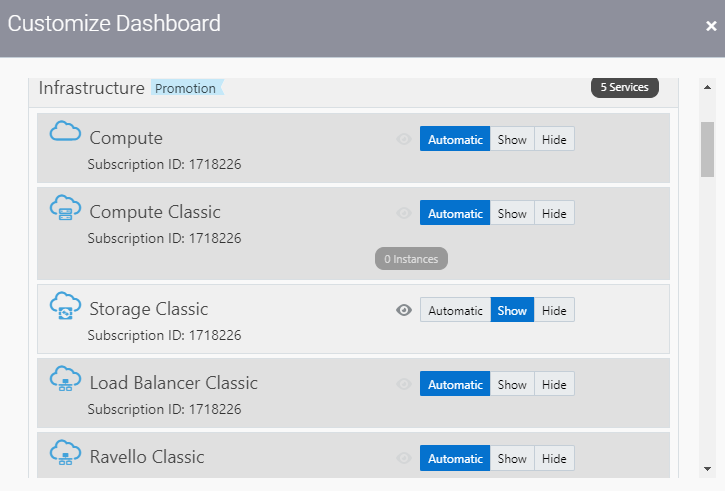

### Check/Set Storage Replication Policy

Depending on the state of your Cloud Account, you will need to set the **Replication Policy**, if it has not been previously set. In this step you will go to the Storage Cloud Service to check on the status of the Replicaton Policy. 

- Click on the **Storage Classic** Cloud Service
    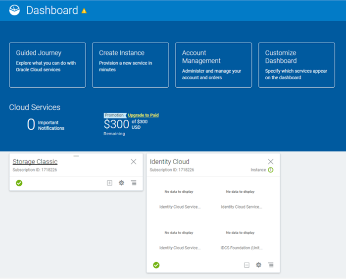

- Click on the **Open Service Console** icon at the top of the screen. For conveinience save the **REST Endpoint**, you will need it to create certain services.

    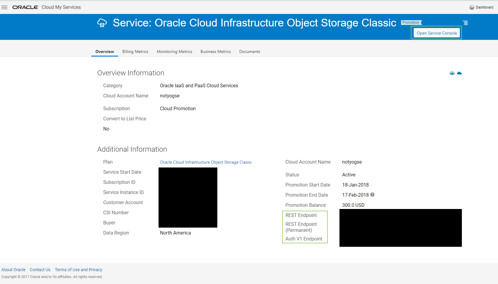

- If the Replication Policy has not been set, use the default and click on the **Set Policy** button. If the message is not displayed, your replication policy has already been set, and your Cloud Account is ready for use.

    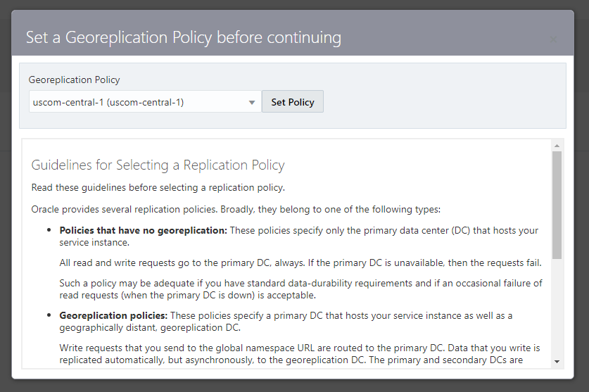

- Your Replication Policy is now set, and Services that require a Replication Policy will work correctly.
